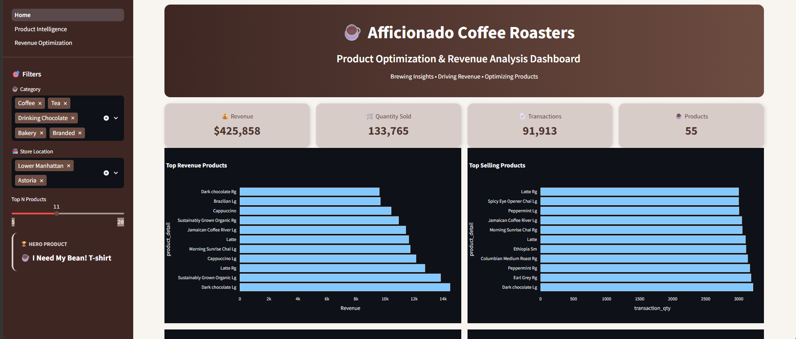
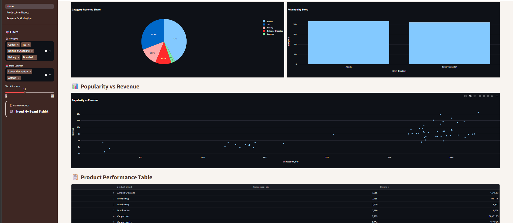
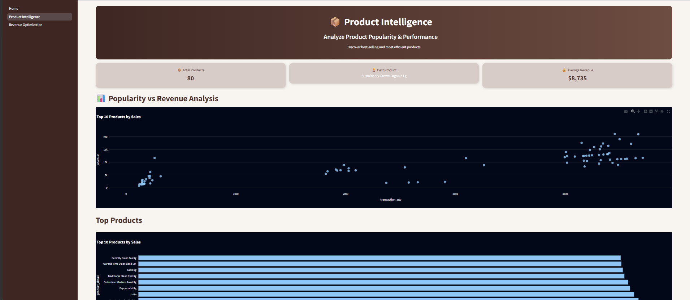
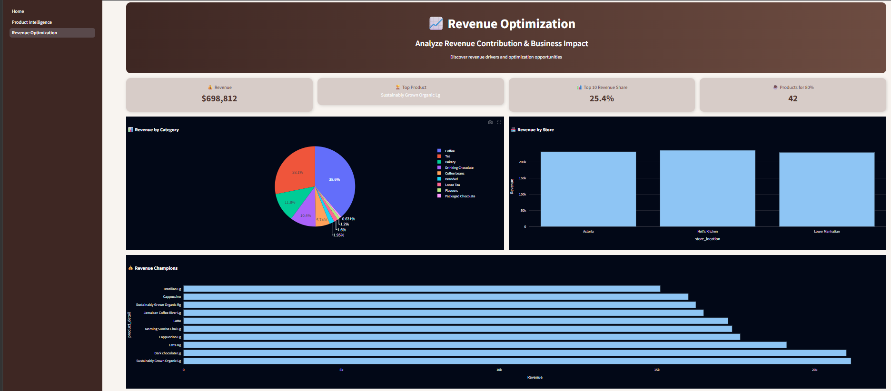
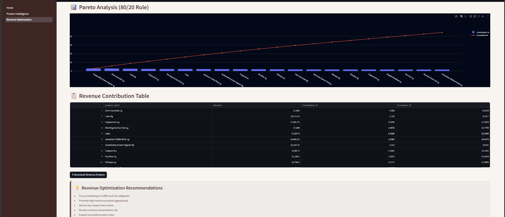

# ☕ Afficionado Coffee Roasters: Product Optimization, Revenue Analysis & ML Prediction Dashboard

## 📌 Project Overview

This project is an interactive Business Intelligence and Machine Learning Dashboard developed using Streamlit, Pandas, Plotly, and Scikit-Learn.

The dashboard helps analyze coffee sales performance, identify revenue-driving products, optimize business decisions, and predict product success using a Machine Learning model.

---

## 🎯 Objectives

* Analyze sales and revenue trends.
* Identify top-performing products.
* Optimize revenue contribution across categories and stores.
* Apply Machine Learning to predict product performance.
* Generate actionable business insights through interactive visualizations.

---

## 🚀 Features

### 🏠 Home Dashboard

* Interactive Filters
* KPI Cards
* Revenue Analysis
* Product Analysis
* Category Revenue Distribution
* Store-wise Revenue Analysis
* Popularity vs Revenue Analysis
* Business Recommendations

---

### 📦 Product Intelligence

* Product Performance Analysis
* Top Products Identification
* Revenue vs Popularity Analysis
* Product Performance Table
* Product Insights

---

### 📈 Revenue Optimization

* Revenue Contribution Analysis
* Revenue by Category
* Revenue by Store
* Pareto (80/20) Analysis
* Revenue Optimization Insights
* Strategic Recommendations

---

### 🤖 ML Product Success Predictor

* Random Forest Classification Model
* Product Success Prediction
* High / Medium / Low Performer Classification
* Prediction Confidence Score
* Feature Importance Analysis
* Machine Learning Insights

---

## 🧠 Machine Learning Component

### Model Used

* Random Forest Classifier

### Features

* Transaction Quantity
* Unit Price
* Product Category
* Store Location

### Target Variable

* Product Performance Category

  * High Performer
  * Medium Performer
  * Low Performer

### Outputs

* Product Success Prediction
* Confidence Score
* Feature Importance Visualization

---

## 🛠️ Tech Stack

| Technology               | Purpose                            |
| ------------------------ | ---------------------------------- |
| Python                   | Data Processing & Backend Logic    |
| Pandas                   | Data Analysis & Manipulation       |
| NumPy                    | Numerical Operations               |
| Plotly                   | Interactive Data Visualizations    |
| Streamlit                | Dashboard Development              |
| Scikit-Learn             | Machine Learning Model Development |
| Random Forest Classifier | Product Success Prediction         |
| GitHub                   | Version Control & Project Hosting  |
| Streamlit Cloud          | Application Deployment             |


---

## 📂 Project Structure

## 📂 Project Structure

```text
Afficionado-Coffee-Revenue-Analysis/
│
├── pages/
│   ├── Product_Intelligence.py
│   ├── Revenue_Optimization.py
│   └── ML_Product_Success_Predictor.py
│
├── Afficionado Coffee Roasters.xlsx - Transactions.csv
├── Home.py
├── Product_Optimization_and_Revenue_Contribution_Analysis.ipynb
├── README.md
├── requirements.txt
│
├── home_dashboard.png
├── home_analytics.png
├── product_intelligence.png
├── revenue_optimization.png
└── pareto_analysis.png
```


---

## 📸 Dashboard Screenshots

## 📸 Dashboard Screenshots

### 🏠 Home Dashboard

```markdown

```


---

### 📊 Home Analytics

```markdown

```


---

### 📦 Product Intelligence

```markdown

```


---

### 📈 Revenue Optimization

```markdown

```


---

### 🎯 Pareto Analysis (80/20 Rule)

```markdown

```


---

### 🤖 ML Product Success Predictor

```markdown

```


```
```


---

## 💡 Key Business Insights

* Coffee and Tea categories contribute the highest revenue.
* A small number of products generate the majority of total revenue.
* Product popularity strongly influences business performance.
* Unit Price and Transaction Quantity are the most important predictors of product success.
* Revenue optimization opportunities exist across product categories and store locations.

---

## 🌐 Live Demo

Streamlit Application:

https://afficionado-coffee-revenue-analysis.streamlit.app/

---

## ⚙️ Installation

Clone the repository:

```bash
git clone https://github.com/mayuri-work/Afficionado-Coffee-Revenue-Analysis.git
```

Navigate to the project directory:

```bash
cd Afficionado-Coffee-Revenue-Analysis
```

Install dependencies:

```bash
pip install -r requirements.txt
```

Run the application:

```bash
streamlit run Home.py
```

---

## 👩‍💻 Author

**Mayuri Gupta**

B.Tech CSE (AI & ML)
IILM University, Greater Noida

LinkedIn:
https://www.linkedin.com/in/mayurigupta4/

GitHub:
https://github.com/mayuri-work

---

## ⭐ Future Enhancements

* Advanced Machine Learning Models
* Sales Forecasting
* Customer Segmentation
* Demand Prediction
* Real-time Data Integration
* AI-powered Business Assistant

---

**Built with ❤️ using Streamlit, Plotly, and Machine Learning**

---

⭐ If you found this project useful, consider giving it a star.
